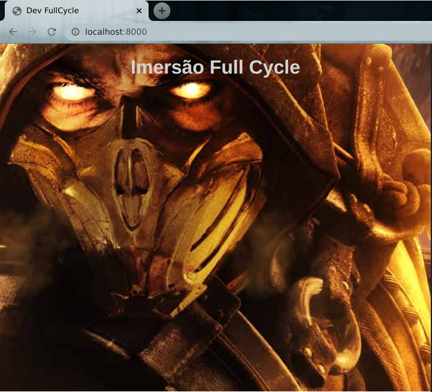

## Imersão Fullcycle 2

 

App built with **Golang** and published with **Docker**.

> Este é um treinamento com mentoria do [Wesley Willians](https://twitter.com/devfullcycle) ([SchoolOfNet](https://www.schoolofnet.com/))

Repo author: [Francis Rodrigues](https://github.com/francisrod01)



## Get started

The app is running on `8000` port.

Go to the `app` folder

### Running the app

Go to `app` folder and run `go main.go`

### Building the app

Go to `app` folder and run `go build main.go`

## Getting from docker

### Pulling from Docker hub

Go to https://hub.docker.com/r/francisrod01/desafio-fullcycle

and run the docker pull command:

```
docker pull francisrod01/desafio-fullcycle
```

### Running the container on localhost

```
docker run -it --rm -p 8000:8000 francisrod01/desafio-fullcycle:0.0.1
```

Than access `http://localhost:8000` to see the app running.

## References

- [The Go Programming Language](https://golang.org/)
- [Use the Docker command line](https://docs.docker.com/engine/reference/commandline/cli/)
- [Docker hub for managing container applications](https://hub.docker.com/)

## License

MIT
